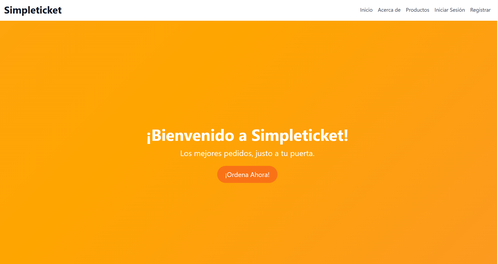
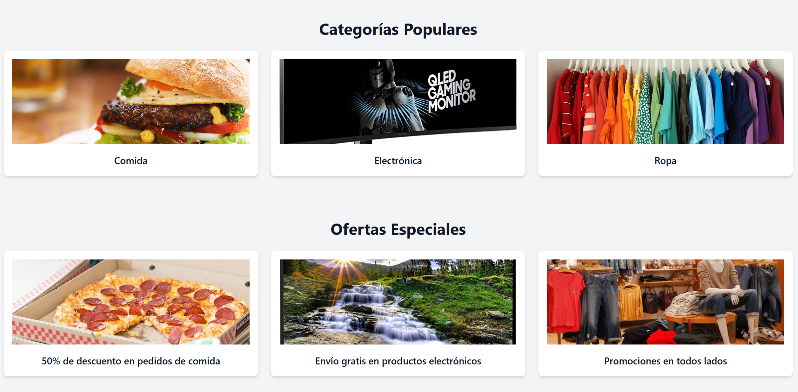
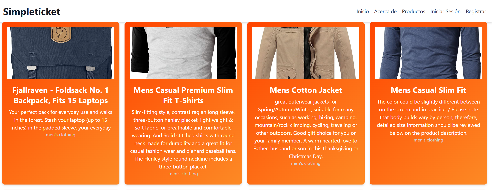
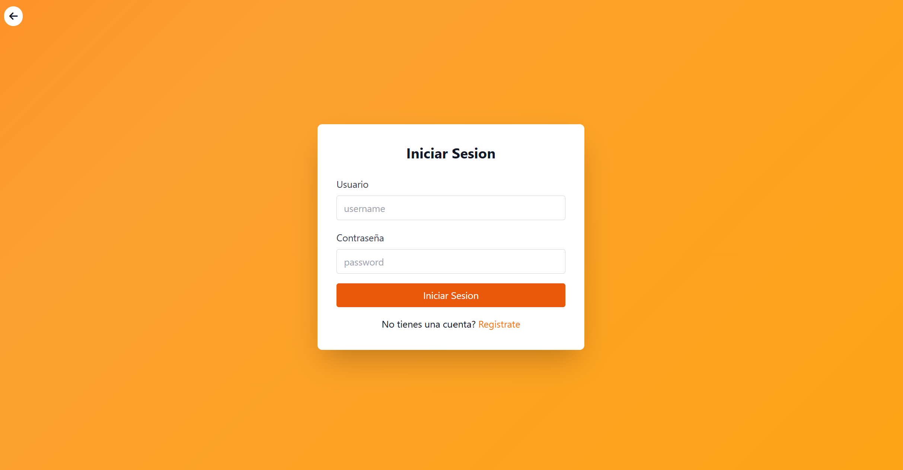
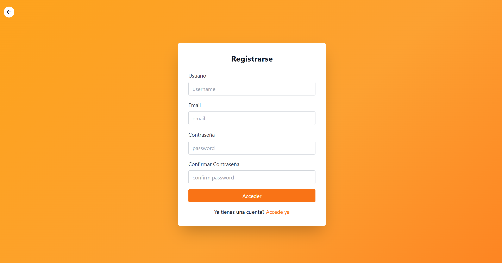
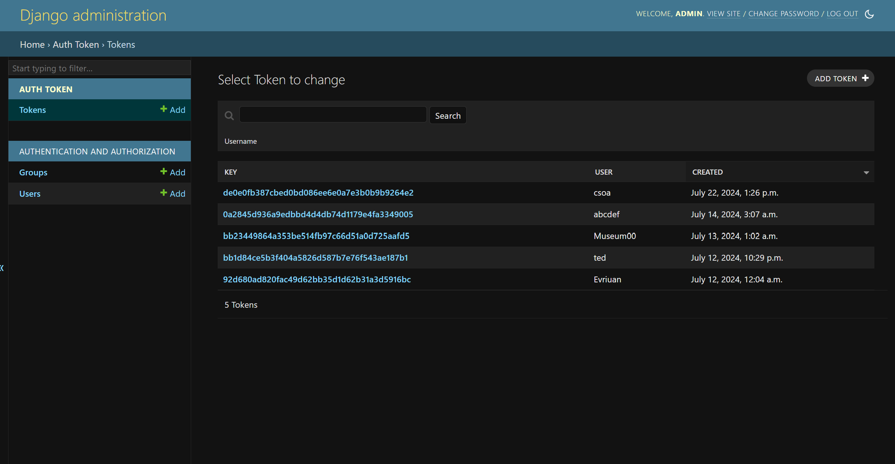
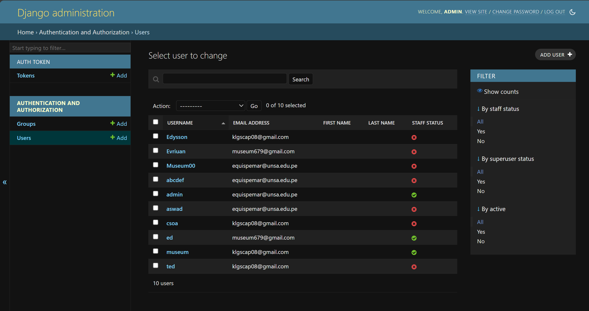

# 🎟️ SimpleTicket

SimpleTicket es una plataforma web **full-stack** de comercio electrónico y gestión de tickets/productos diseñada bajo estándares profesionales de desarrollo de software. Combina un backend robusto, modular y seguro implementado en **Django (REST Framework)** con un frontend SPA moderno, reactivo y de alta fidelidad estética desarrollado en **Angular** y estilizado con **Tailwind CSS** y **PrimeNG**.

Este proyecto adopta patrones de arquitectura avanzados (Capa de Repositorio y Servicio), estrictos mecanismos de seguridad (Throttling, cabeceras seguras, CORS) y una experiencia de usuario premium (modo oscuro persistente, carrito lateral interactivo, checkout multi-paso, skeletons y seguimiento en tiempo real).

---

## 📸 Galería del Proyecto (Capturas de Pantalla)

Aquí puedes ver la interfaz de usuario moderna y estilizada de SimpleTicket:

### 🏠 Inicio y Landing Page

*Vista de portada del e-commerce con promociones y diseño adaptable.*


*Listado principal y secciones destacadas con micro-animaciones.*

### 🛍️ Catálogo de Productos y Compra

*Listado interactivo de productos con carrito lateral flotante y skeleton loader durante la carga.*

### 🔐 Autenticación de Usuarios

*Formulario de inicio de sesión con validación interactiva y tema adaptado.*


*Formulario de registro intuitivo para nuevos clientes.*

### ⚙️ Panel de Administración y Gestión

*Dashboard administrativo para el control de inventarios, pedidos e ingresos.*


*Panel de administración para la gestión de usuarios, roles y permisos de acceso.*

---

## 🛠️ Arquitectura y Características Clave

### 💻 Backend (Django & DRF)
*   **Patrón Repository & Service**: Separación estricta de la lógica de negocio y la persistencia de datos.
    *   *Repositories*: Encapsulan las operaciones ORM de consulta (`ProductRepository`, `OrderRepository`), garantizando que la base de datos pueda ser sustituida o modificada sin afectar la lógica superior.
    *   *Services*: Centralizan las reglas de negocio críticas (`ProductService`, `OrderService`), asegurando operaciones atómicas como la validación transaccional y la deducción automática de stock durante la creación de pedidos.
*   **APIs Modulares**:
    *   `api.account`: Autenticación, creación de cuentas de usuario, perfiles y tokens.
    *   `api.products`: Listado, búsqueda, categorización y detalles de productos.
    *   `api.orders`: Gestión segura de pedidos y seguimiento del historial de compras.
*   **Seguridad Reforzada**:
    *   **Rate Limiting (Throttling)**: Limitación del número de peticiones por IP y usuario para prevenir ataques de denegación de servicio (DoS) y fuerza bruta.
    *   **Security Headers**: Configuración activa de políticas de protección como `X-Frame-Options` para evitar clickjacking, `X-Content-Type-Options` y filtros XSS.
    *   **CORS Seguro**: Configurado para aceptar únicamente peticiones del dominio del frontend en desarrollo y producción.
*   **Monitoreo y Observabilidad**: Logs estructurados en formato JSON para simplificar el análisis de errores en producción.
*   **Poblamiento de Datos (Seeding)**: Comando personalizado `python manage.py seed_db` para pre-cargar categorías, stock e imágenes iniciales realistas en la base de datos de manera automatizada.

### 🎨 Frontend (Angular & Tailwind CSS / PrimeNG)
*   **Estructura Reactiva SPA**: Implementado en **Angular** empleando componentes funcionales reactivos y un flujo de comunicación basado en servicios.
*   **Autenticación Integrada con Google (GSI)**: Botón nativo de Google Sign-In y Sign-Up de un solo clic, integrado en los formularios de Login y Registro de forma fluida y asíncrona.
*   **Manejo de Entornos**: Variables del proyecto centralizadas en archivos `.env` (backend) y `environments/` (frontend) para facilitar el paso entre desarrollo y producción.
*   **Diseño Visual Premium**:
    *   **Tipografía de Vanguardia**: Uso de *Outfit* para títulos (display moderno) e *Inter* para lectura (alta legibilidad), importadas directamente de Google Fonts.
    *   **Paleta de Colores Curada**: Variables Sass que definen una escala cromática profesional basada en marcas líderes como Shopify y Mercado Libre.
    *   **Modo Oscuro/Claro Nativo**: `ThemeService` sincronizado con Tailwind CSS y persistencia automática en el navegador a través de `localStorage`.
    *   **Diseño Neumórfico y Glassmorphism**: Cards de productos con elevación dinámica, desenfoque de fondo en modales y transiciones fluidas de hover.
*   **Experiencia de Compra Interactiva**:
    *   **Carrito Lateral Persistente**: Panel lateral deslizante (Drawer Panel) gestionado por `CartService` que permite modificar cantidades y eliminar artículos sin recargar la página.
    *   **Wizard Checkout de 3 Pasos**: Proceso de compra guiado (1. Revisión, 2. Envío, 3. Pago) con validaciones dinámicas y reactivas de formularios.
    *   **Pasarela de Pago Simulada**: Simulador de pagos integrado en el Checkout que emula un procesamiento bancario real (Validación -> Fondos -> Aprobación) con formateo y enmascaramiento dinámico de tarjetas de crédito en tiempo real.
    *   **Línea de Tiempo del Pedido (Order Tracker)**: Componente visual interactivo para que los usuarios monitoreen si su pedido está `PENDIENTE`, `ENVIADO` o `ENTREGADO`.
    *   **Skeleton Loaders**: Efecto de carga shimmer que reduce la percepción del tiempo de espera del usuario.

---

## 📁 Estructura del Código

```plaintext
SimpleTicket/
│
├── blog_backend/              # Servidor Backend (Django)
│   ├── api/                   # Módulos de la API REST
│   │   ├── account/           # Autenticación y Perfil de Usuario
│   │   ├── products/          # Repositorio, Servicio y Endpoints de Productos
│   │   └── orders/            # Repositorio, Servicio y Endpoints de Pedidos
│   │
│   ├── blog_backend/          # Configuración del Proyecto (Settings, URLs, Logs)
│   ├── requirements.txt       # Dependencias de Python
│   └── manage.py              # Gestor de Comandos Django
│
├── blog_frontend/             # Servidor Frontend (Angular 20 SPA)
│   ├── src/
│   │   ├── app/
│   │   │   ├── components/    # Home, Header, Footer, List (Catálogo), Detail, Profile
│   │   │   └── services/      # CartService, ThemeService, ListaService, Accounts
│   │   │
│   │   ├── environments/      # Configuraciones de Entorno (desarrollo/producción)
│   │   │   ├── environment.ts
│   │   │   └── environment.development.ts
│   │   │
│   │   ├── styles/            # Sistema de Estilos SCSS
│   │   │   ├── variables.scss # Paleta de colores, sombras y espaciados
│   │   │   ├── typography.scss# Fuentes (Outfit & Inter) y clases tipográficas
│   │   │   ├── buttons.scss   # Estilizado de botones neumórficos
│   │   │   └── styles.sass    # Estilo global de la aplicación
│   │   │
│   │   └── main.ts            # Punto de entrada de la aplicación Angular
│   │
│   ├── angular.json           # Configuración del compilador y assets
│   ├── package.json           # Scripts de npm y dependencias del frontend
│   └── tailwind.config.js     # Configuración de Tailwind CSS
│
└── screenshoots/              # Capturas de pantalla e imágenes de documentación
```

---

## 🚀 Instalación y Configuración Paso a Paso

### Requisitos del Sistema
*   **Python 3.10+**
*   **Node.js (v18+)** e **npm (v9+)**

---

### 1. Servidor Backend (Django)

1.  **Ingresar al directorio de backend**:
    ```bash
    cd blog_backend
    ```

2.  **Configurar el entorno virtual**:
    *   En Windows:
        ```bash
        python -m venv venv
        .\venv\Scripts\activate
        ```
    *   En macOS o Linux:
        ```bash
        python3 -m venv venv
        source venv/bin/activate
        ```

3.  **Instalar dependencias**:
    ```bash
    pip install -r requirements.txt
    ```

4.  **Configurar variables de entorno**:
    Crea un archivo llamado `.env` en la raíz del directorio `blog_backend/` y define lo siguiente:
    ```env
    SECRET_KEY=tu-clave-secreta-personalizada
    DEBUG=True
    ALLOWED_HOSTS=localhost,127.0.0.1
    ```

5.  **Preparar y Sembrar la Base de Datos**:
    ```bash
    python manage.py migrate
    python manage.py seed_db
    ```

6.  **Crear un Superusuario para el Panel de Administración (Opcional)**:
    ```bash
    python manage.py createsuperuser
    ```

7.  **Iniciar el servidor de desarrollo**:
    ```bash
    python manage.py runserver
    ```
    *El backend estará disponible en: `http://localhost:8000/`*

---

### 2. Servidor Frontend (Angular)

1.  **Ingresar al directorio de frontend**:
    ```bash
    cd ../blog_frontend
    ```

2.  **Instalar dependencias de Node**:
    ```bash
    npm install
    ```

3.  **Configurar archivos de entorno**:
    Edita los archivos generados en `src/environments/environment.ts` y `environment.development.ts` para ingresar la base URL de tu API de Django y el Client ID de Google:
    ```typescript
    export const environment = {
      production: false, // o true para producción
      apiUrl: 'http://localhost:8000/api/',
      googleClientId: 'TU_GOOGLE_CLIENT_ID.apps.googleusercontent.com'
    };
    ```

4.  **Iniciar el servidor de desarrollo**:
    ```bash
    npm start
    ```

5.  **Acceder a la aplicación**:
    Abre tu navegador e ingresa a: `http://localhost:4200`

---

## 📡 Detalle de la API REST

Todos los endpoints del backend están prefijados con `/api`. Los endpoints protegidos requieren el envío de la cabecera `Authorization: Token <token>`.

| Módulo | Endpoint | Método HTTP | Auth Requerido | Descripción |
| :--- | :--- | :---: | :---: | :--- |
| **Cuentas** | `/api/signup/` | `POST` | No | Registra un nuevo usuario en la plataforma. |
| **Cuentas** | `/api/signin/` | `POST` | No | Inicia sesión y retorna el token de autenticación. |
| **Cuentas** | `/api/profile/` | `GET` | Sí | Obtiene los detalles de perfil del usuario autenticado. |
| **Cuentas** | `/api/profile/update/` | `PUT` | Sí | Actualiza los datos del perfil (dirección, nombre, etc.). |
| **Productos** | `/api/products/` | `GET` | No | Retorna el listado completo de productos (soporta filtros). |
| **Productos** | `/api/products/<id>/` | `GET` | No | Retorna el detalle completo de un producto por su ID. |
| **Pedidos** | `/api/orders/` | `GET` | Sí | Retorna el historial de compras del usuario autenticado. |
| **Pedidos** | `/api/orders/` | `POST` | Sí | Procesa y registra un nuevo pedido de compra. |

#### Ejemplo de Cuerpo de Petición para crear un Pedido (`POST /api/orders/`):
```json
{
  "items": [
    {"product_id": 1, "quantity": 2},
    {"product_id": 3, "quantity": 1}
  ],
  "shipping_address": "Calle Falsa 123, Ciudad de Primavera"
}
```

---

## 🧪 Pruebas Automatizadas y Calidad

### Pruebas de Backend
Para ejecutar los tests automatizados que validan la lógica de negocio en la capa de servicios y la integridad del repositorio:
```bash
cd blog_backend
.\venv\Scripts\activate  # En Windows
python manage.py test
```

### Compilación y Calidad en Frontend
Para validar que el tipado de TypeScript sea consistente y compilar el proyecto optimizando los assets estáticos:
```bash
cd blog_frontend
npm run build
```
